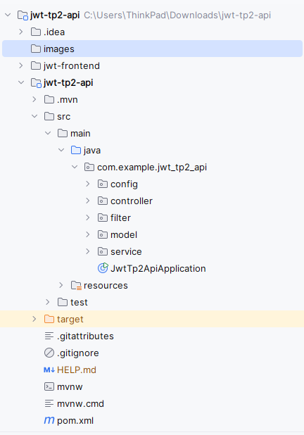
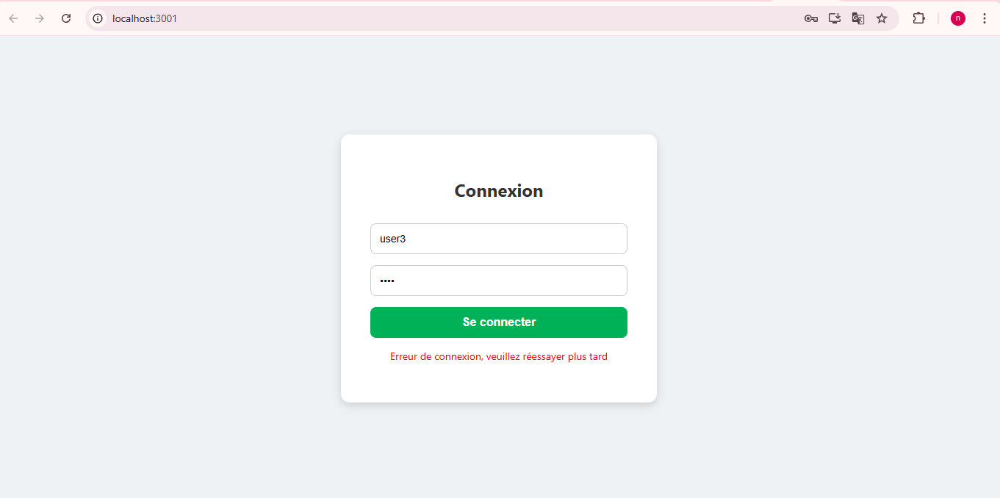
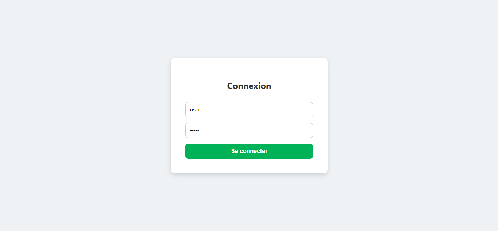
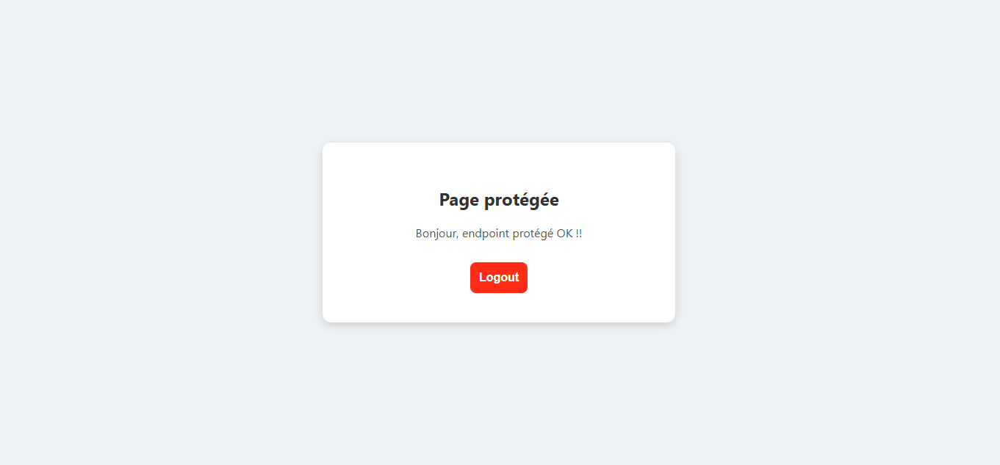

# TP2-Authentification-JWT
A simple web application demonstrating **JWT-based authentication** using **Spring Boot** for the backend and **React** for the frontend.  
The app supports login, accessing a protected page, and logout functionality.

## Table of Contents

- [Overview](#overview)  
- [Technologies Used](#technologies-used)  
- [Project Architecture](#project-architecture)  
- [Testing](#testing)  

## Overview

This application allows users to log in with a username and password. After successful authentication, the backend issues a **JWT token** which the frontend stores in `localStorage`.  
The protected page (`/hello`) can only be accessed with a valid JWT token. Users can also log out, which removes the token from storage.

## Technologies Used

- **Backend**:   
  - Spring Boot  
  - Spring Security
  - Spring Web 
  - JWT  

- **Frontend**:  
  - React 
  - Axios  

---

## Project Architecture
### Project Structure

### Backend Endpoints

| Endpoint                 | Method | Description                     |
|---------------------------|--------|---------------------------------|
| `/api/auth/login`         | POST   | Authenticate user & get JWT    |
| `/api/hello`              | GET    | Protected endpoint (JWT needed)|

### Frontend Flow

1. **Login Page** (`Login.js`): User enters credentials → sends request to backend.  
2. **JWT Token**: Backend returns JWT → stored in `localStorage`.  
3. **Protected Page** (`Hello.js`): Sends JWT in `Authorization` header → backend validates token → displays message.  
4. **Logout**: Removes JWT from `localStorage` → returns to login page.

---

## Testing
### Login Page
1. **Invalid credentials**  
   - Enter wrong username or password

2. **Successful login**  
   - Enter valid credentials (e.g., `user / 12345`)

### Protected Hello Page

